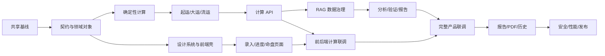

# 优化后的开发计划

## 依赖总览

前端在 Schema 冻结后使用 mock 并行开发，不等待 RAG 和模型完成。

## S0：Monorepo 与质量基线

### 任务

- 初始化 Python、Vue/TypeScript 和共享契约目录；
- 配置 formatter、lint、严格类型检查、单元测试和 CI；
- 创建实施状态、决策日志和契约差异日志；
- 导入本包的 Schema、设计 Token、基础表和 mock。

### Gate

- 后端和前端空项目均可构建；
- OpenAPI 可生成 TypeScript 类型；
- 不存在绝对路径、明文密钥和生产域名硬编码。

## S1：领域模型、Schema 与 API 契约

- 实现 BirthRequest、Chart、Qiyun、Dayun、Temporal、Analysis、Validation、Report、JobEvent；
- 固定错误码和异步任务状态机；
- 建立 DTO → view model mapper 契约；
- 增加契约快照测试。

### Gate

示例 JSON 同时通过 JSON Schema、Pydantic 和前端运行时校验。

## B1：时间、历法和四柱

- 时区、DST、真太阳时策略；
- 临界风险；
- `lunar_python` 主适配器和 `sxtwl` 复核适配器；
- 公历/农历、节气和四柱；
- 双引擎差异报告。

## F1：设计系统和前端应用壳（可与 B1 并行）

- 导入 design tokens；
- 实现 AppShell、顶部栏、侧栏/底部导航、响应式容器；
- 建立路由、错误边界、通知和 skeleton；
- 将静态原型转为组件 Story 页面；
- 建立 Playwright 截图基线。

## B2：基础规则、起运、大运和流运

- 十神、藏干、关系、纳音、十二长生、空亡和核心神煞；
- 顺逆排、参考节、折算和大运；
- 按需流年、流月、流日和关系上下文。

## F2：出生信息向导与临界确认（使用 mock）

- 4 步向导；
- 地点、时区和时间精度；
- 高级口径；
- 表单恢复和草稿；
- 临界候选命盘比较页；
- 无障碍键盘流程。

## B3：计算 CLI、API、持久化和任务内核

- 计算 CLI；
- chart CRUD；
- 幂等键；
- PostgreSQL 持久化；
- 稳定错误码；
- 分析任务与 SSE 基础设施。

## F3：计算进度和命盘核心页面（使用 mock）

- AnalysisProgress；
- ChartOverview；
- StructureAnalysis；
- DayunTimeline；
- Year/Month/Day 路由框架；
- loading / empty / partial / error / stale 状态。

## I1：确定性计算前后端联调

- 用生成类型替换 mock 类型；
- 向导提交真实计算 API；
- 候选命盘确认；
- 命盘与大运页面对接真实数据；
- 确认前端没有自行计算。

## A1：RAG 数据治理与检索

- raw → quarantine → approved 状态机；
- 来源、许可、语言、版本、去重和污染检查；
- 规则/古籍/案例/反例分层切分；
- 结构化过滤 + 全文 + 向量 + 重排；
- 引用追踪。

## A2：智能体、分析、验证和报告块

- 编排器、检索规划器、解释器、验证器和报告编辑器；
- provider adapter；
- StructuredAnalysis；
- 结构化 ReportBlock；
- 任何事实或引用错误拒绝通过。

## F4：流运交互、证据抽屉和报告阅读（mock/真实并行）

- 大运双轴和当前定位；
- 流年、流月日历和流日上下文；
- 事实/规则/模型三层视觉；
- EvidenceDrawer；
- 报告目录、章节、引用和专业模式。

## I2：完整分析流水线联调

- 创建分析任务；
- SSE 断线重连；
- 验证失败与局部重试；
- 报告生成；
- 成本、超时和取消；
- 不展示 CoT。

## R1：历史、PDF、分享和设置

- 历史记录、匿名备注、删除、重新分析；
- 专用 print route；
- PDF 页眉页脚、分页和引用；
- 分享默认关闭、可撤销、可过期；
- 模型和计算配置只读/管理员设置。

## H1：评估、安全、性能与发布

- BaziQA、MingLi-Bench 物理隔离评测；
- 提示注入、数据污染、XSS、CSRF、越权和敏感日志检查；
- E2E、视觉、axe、性能预算；
- 数据备份、删除和恢复演练；
- 发布检查表和回滚方案。

## 最终 Gate

- 确定性 Golden 测试 100%；
- 正式报告的事实和引用验证 100%；
- 核心用户流程桌面/移动 E2E 通过；
- 关键页面视觉回归通过；
- 无严重无障碍问题；
- 性能和隐私预算达标；
- 所有完成声明均有命令、日志和截图证据。
