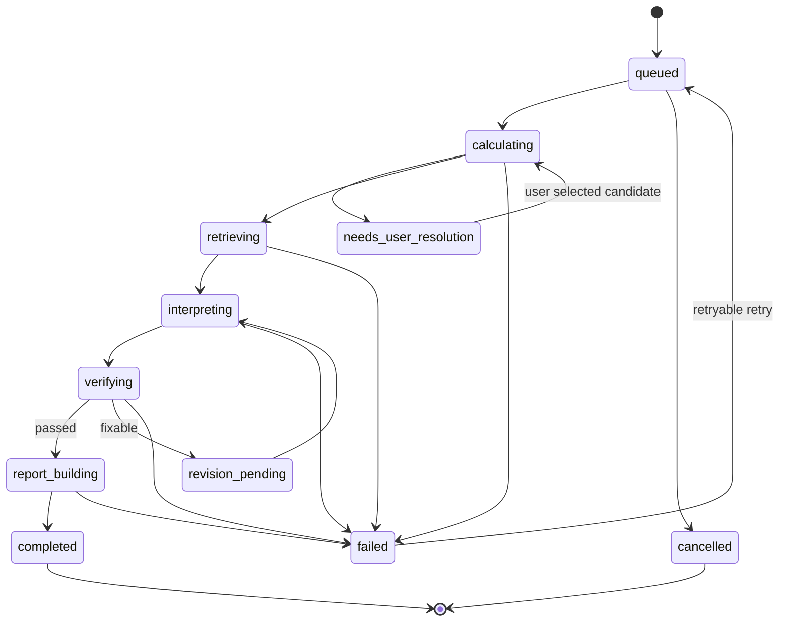

# 异步分析任务状态机

## 事件字段

- `event_id`：单调递增或可排序 ID；
- `job_id`；
- `stage`；
- `progress`：0–100，仅表示阶段完成度，不伪装模型精确剩余时间；
- `message_key`：前端本地化 key；
- `occurred_at`；
- `retryable`；
- `safe_details`：无敏感信息；
- `result_ref`：完成后资源 ID。

## 恢复

- 前端保存最后 `event_id`；
- SSE 使用 `Last-Event-ID`；
- 连接失败退避重连；
- 断线超过阈值时轮询 job endpoint；
- 页面刷新后根据 URL 中 job_id 恢复。
