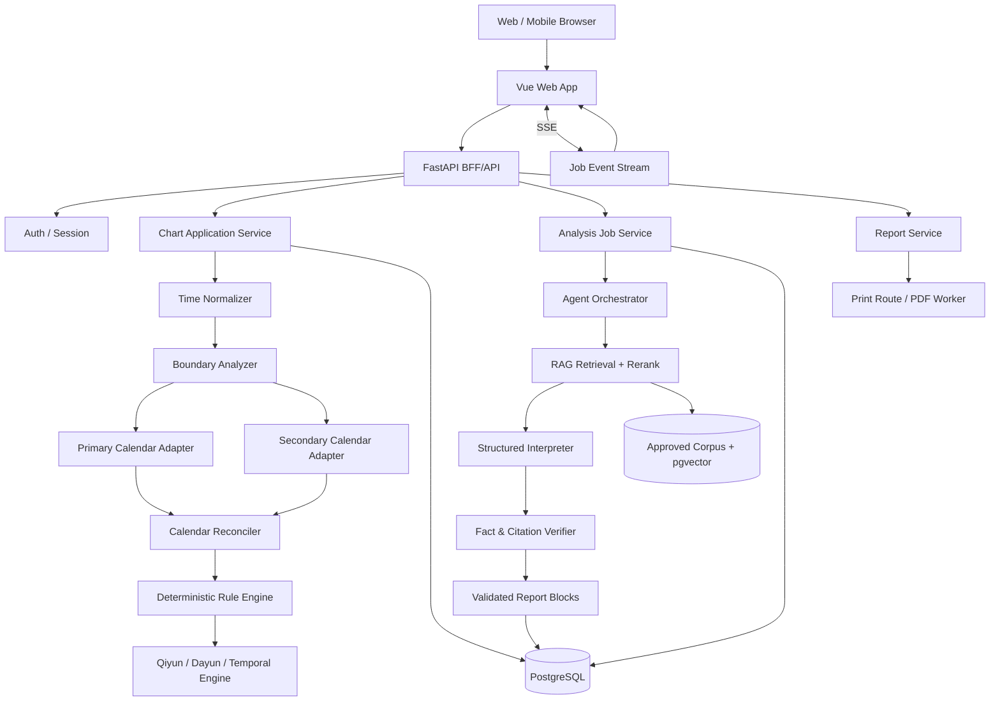
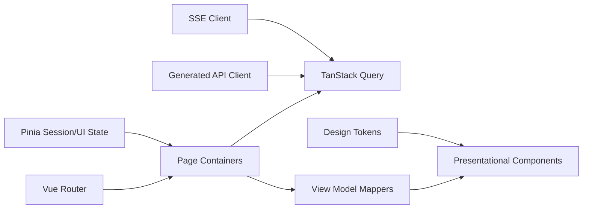

# 完整系统架构

## 前端内部

## 信任层级

### 高信任

- 版本化计算配置；
- 经过测试的确定性规则；
- 双引擎一致结果；
- approved 且可追溯的知识块。

### 中信任

- 单一历法库结果；
- 专家审核案例；
- 经程序校验的合成数据。

### 低信任

- 模型生成文本；
- 未审核网络语料；
- OCR；
- 原始自由文本 CoT；
- 用户提供的现实经历。

低信任信息不得覆盖高信任事实。前端必须在视觉上体现层级，而不是把全部内容显示成同一种“结论卡”。
